# DEVOPS TOOLING WEBSITE SOLUTION
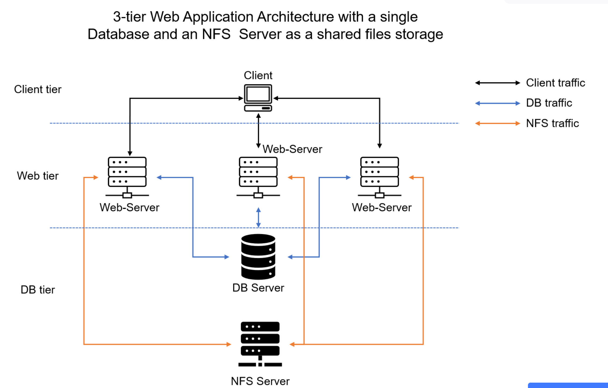

### Prerequites
Create a Virtual Private Cloud (VPC) and associate both a private and a public subnet with it. Link the public subnet to a route table that's connected to an internet gateway. Following this, initiate the deployment of three instances running Red Hat Enterprise Linux in the public subnet; these instances will function as web servers. Simultaneously, deploy an additional instance running Red Hat Enterprise Linux in the private subnet, serving as the NFS (Network File System) server. Lastly, provision an Ubuntu instance within the private subnet, designated as the database server.

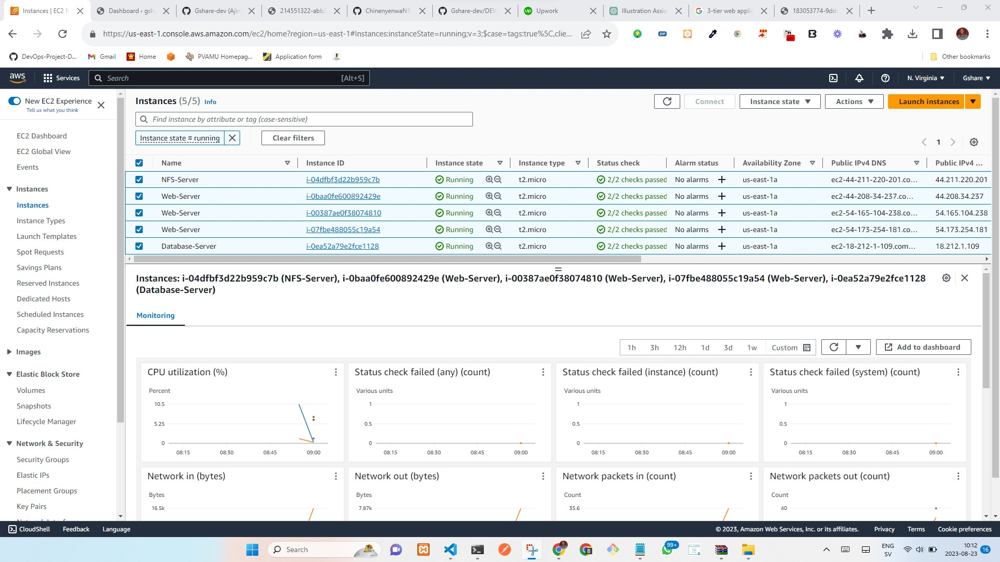

### Step 1 - Prepare NFS server

Before kick-starting, provision three Elastic Block Storage (EBS) Volumes and attach them to the NFS server.

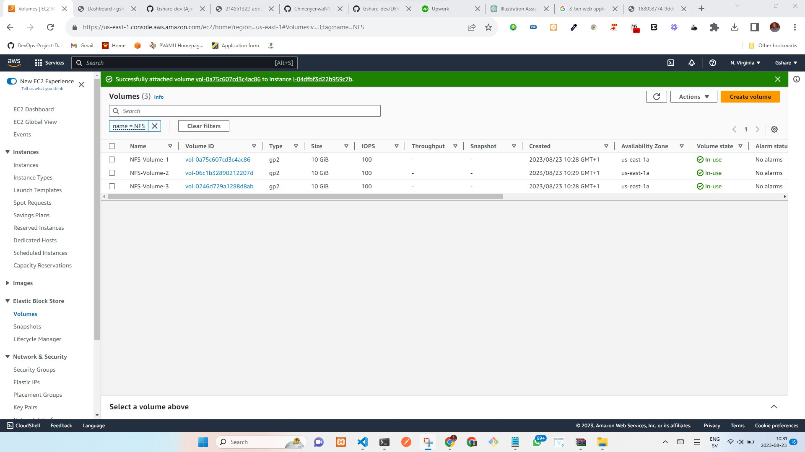

Sign into the NFS server through SSH. To view all logical volumes, run the command `lsblk` The 3 newly created block devices are names **xvdf**, **xvdh**, **xvdg** respectively.


Use gdisk utility to create a single partition on each of the 3 disks 
```
sudo gdisk /dev/xvdf
```
A prompt pops up,
Command (? for help): n

Partition number (1-128, default 1): 1

First sector (34-20971486, default = 2048) or {+-}size{KMGTP}: ENTER


Last sector (2048-20971486, default = 20971486) or {+-}size{KMGTP}: ENTER

Current type is 8300 (Linux filesystem): 8300

Command (? for help): p

Command (? for help): w

Do you want to proceed? (Y/N): y

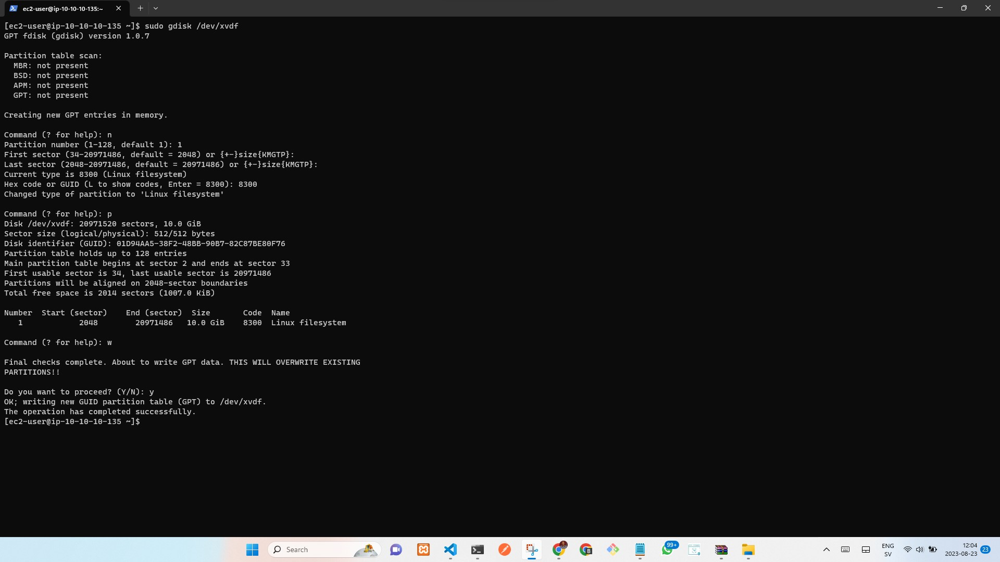

```
sudo gdisk /dev/xvdh
sudo gdisk /dev/xvdg
```

Type `lsblk` to view newly created partition.

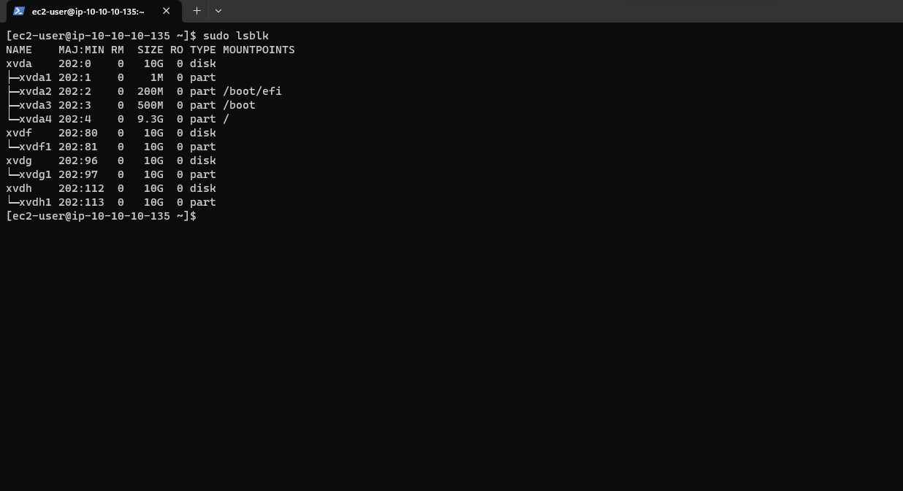

Install lvm2 package by running the below command to check for available partitions.

```
sudo yum install lvm2
``` 

```
sudo lvmdiskscan
``` 
Create physical volume to be used by lvm by using the pvcreate command:
```
sudo pvcreate /dev/xvdf1 /dev/xvdg1 /dev/xvdh1
```
To check if the PV have been created successfully, run: 

    sudo pvs

Next, Create the volume group and name it webdata-vg: 

    sudo vgcreate webdata-vg /dev/xvdf1 /dev/xvdg1 /dev/xvdh1

View newly created volume group type:

    sudo vgs

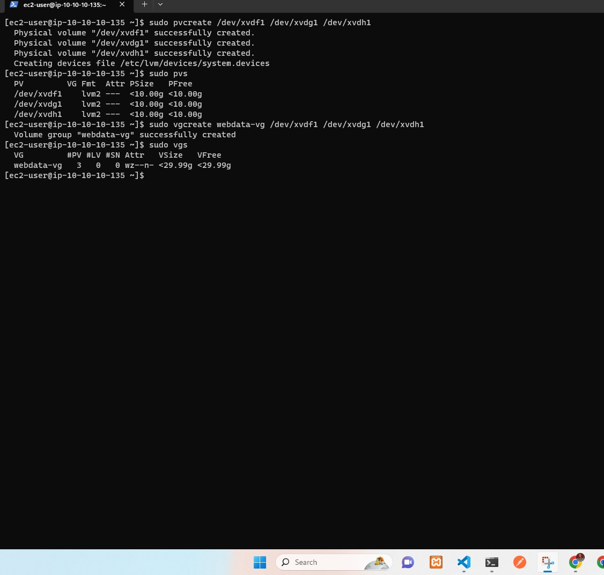

- Create 3 logical volumes using lvcreate utility. Name them: lv-apps for storing data for the website, lv-logs for storing data for logs and lv-opt for Jenkins Jenkins server in project 8.
```
sudo lvcreate -n lv-apps -L 9G webdata-vg
sudo lvcreate -n lv-logs -L 9G webdata-vg
sudo lvcreate -n lv-opt -L 9G webdata-vg
```
- Verify Logical Volume has been created successfully by running:
```
sudo lvs
```
- 
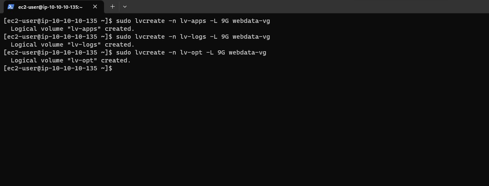

- then format the logical volumes with ext4 filesystem:
```
sudo mkfs -t xfs /dev/webdata-vg/lv-apps
sudo mkfs -t xfs /dev/webdata-vg/lv-logs
sudo mkfs -t xfs /dev/webdata-vg/lv-opt
```
- Next, create mount points for the logical volumes. Create **/mnt/apps** the following directory to store website files: 
```
sudo mkdir /mnt/apps
sudo mkdir /mnt/logs
sudo mkdir /mnt/opt
```
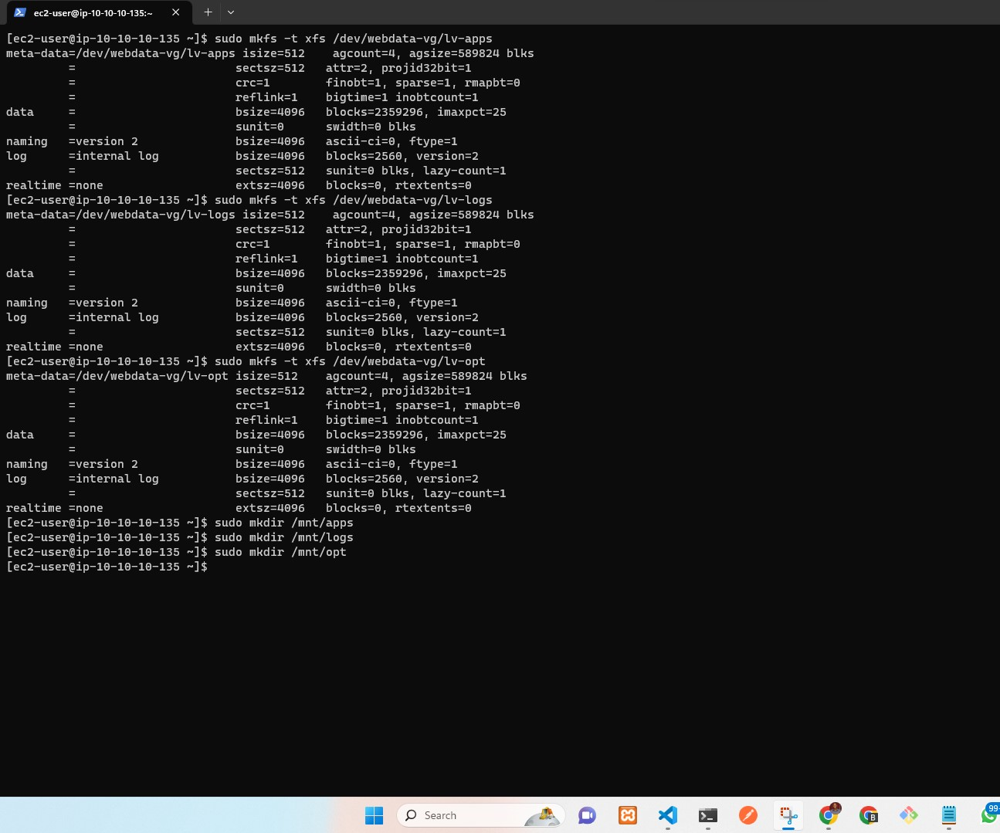

- Mount to **/dev/webdata-vg/lv-apps** **/dev/webdata-vg/lv-apps** and **/dev/webdata-vg/lv-opt** respectievly : 
```
sudo mount /dev/webdata-vg/lv-apps /mnt/apps
sudo mount /dev/webdata-vg/lv-logs /mnt/logs
sudo mount /dev/webdata-vg/lv-opt /mnt/opt
```
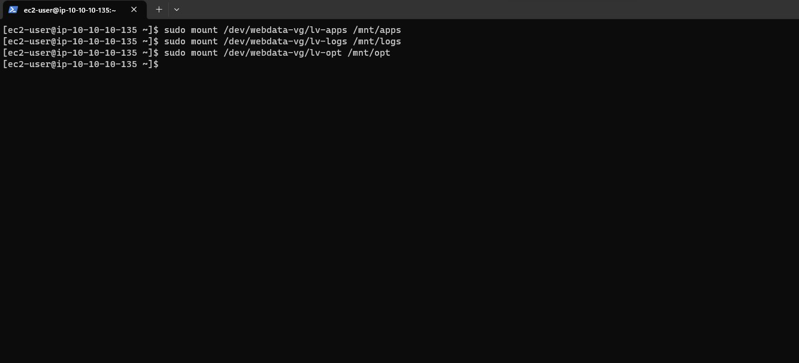

Install NFS server, configure it to start on reboot and make sure it is up and running
```
sudo yum -y update && sudo yum install nfs-utils -y
sudo systemctl start nfs-server.service
sudo systemctl enable nfs-server.service
sudo systemctl status nfs-server.service
```
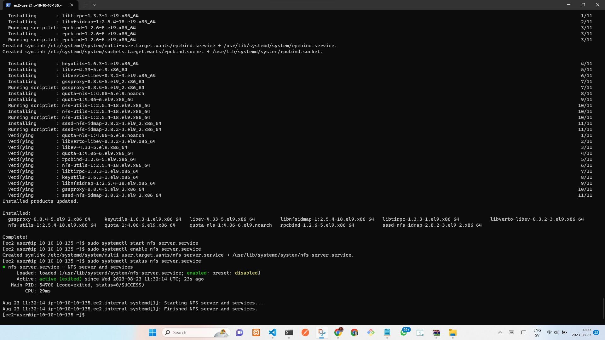

Set up permission that will allow our Web servers to read, write and execute files on NFS:
```
sudo chown -R nobody:nobody /mnt/apps
sudo chown -R nobody:nobody /mnt/logs
sudo chown -R nobody:nobody /mnt/opt

sudo chmod -R 777 /mnt/apps
sudo chmod -R 777 /mnt/logs
sudo chmod -R 777 /mnt/opt

sudo systemctl restart nfs-server.service
```


using text editor, configure access to NFS for clients within the same VPC (my Subnet CIDR – 10.10.10.0/24 ):
```
sudo vi /etc/exports
```

    /mnt/apps 10.10.10.0/24(rw,sync,no_all_squash,no_root_squash)
    /mnt/logs 10.10.10.0/24(rw,sync,no_all_squash,no_root_squash)
    /mnt/opt 10.10.10.0/24(rw,sync,no_all_squash,no_root_squash)

Esc + :wq!

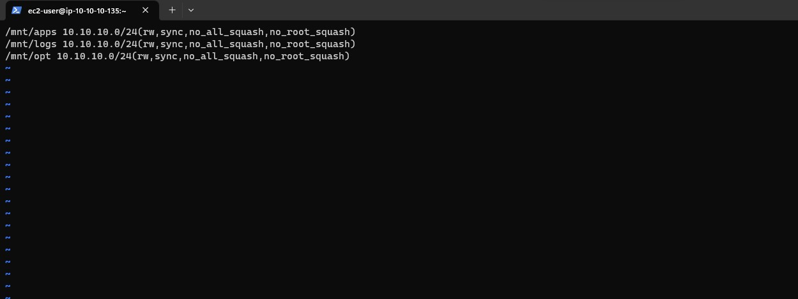

```
sudo exportfs -arv
```
Check which port is used by NFS and open it using Security Groups (add new Inbound Rule)

```
rpcinfo -p | grep nfs
```

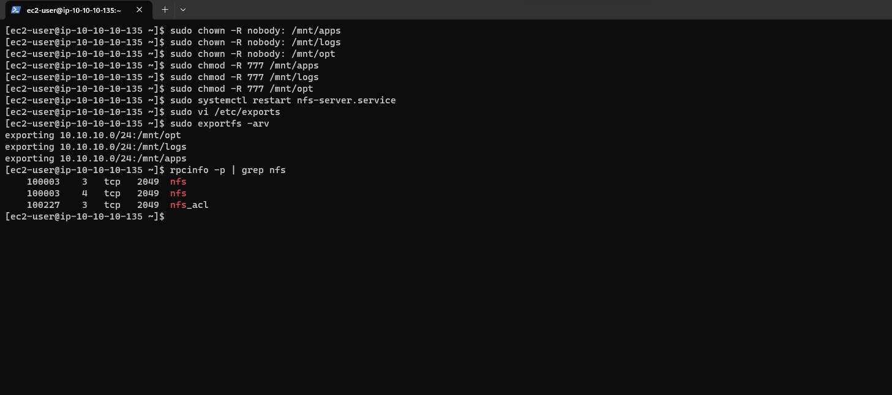

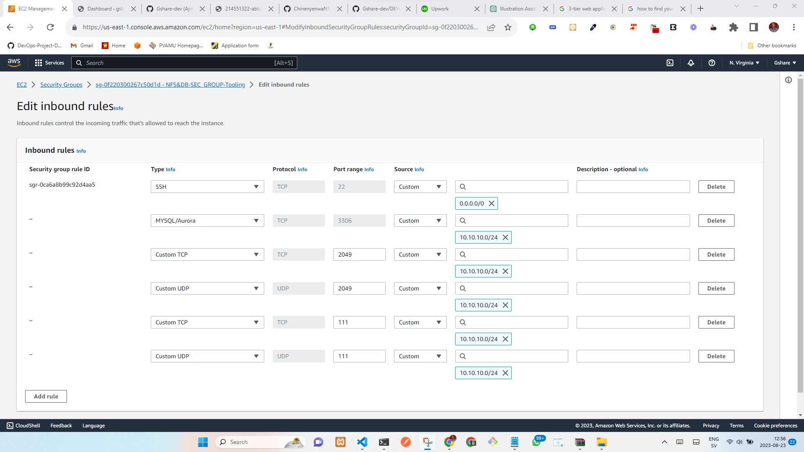

### CONFIGURE THE DATABASE SERVER
Install and configure a MySQL DBMS to work with remote Web Server
SSH in to the provisioned DB server and run an update and install mysql

```
sudo apt update && sudo upgrade -y
```

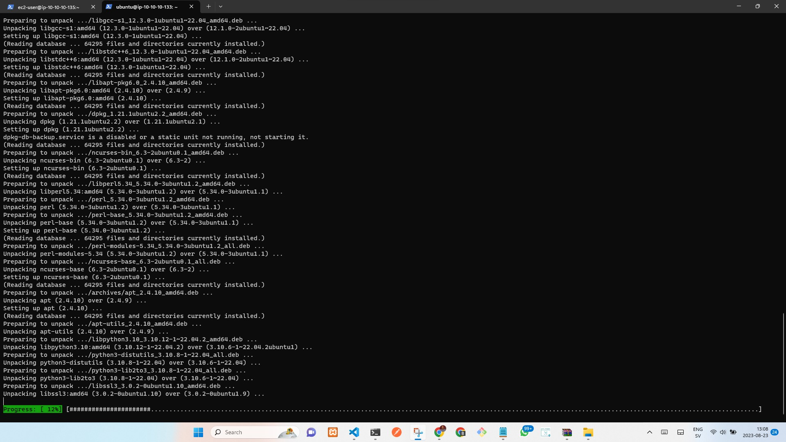

```
sudo apt install mysql-server -y
```

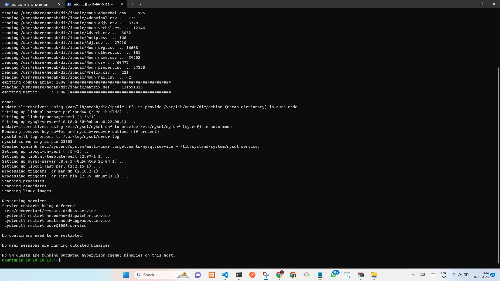

Create a database and name it **tooling**: 

```
sudo mysql
```
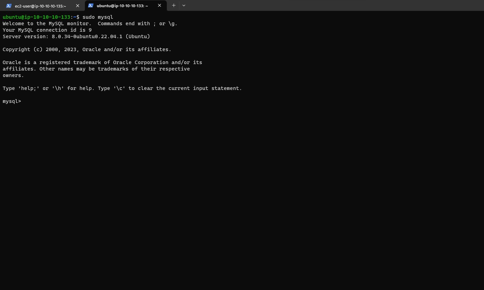

create database toolling;

Create a database user and name it **webaccess** and grant permission to **webaccess** user on tooling database to do anything only 
from the webservers subnet cidr:

    create user 'webacces'@'10.10.10.0/24' identified by 'password';

```
grant all privileges on toolling.* to 'webacces'@'10.10.10.0/24';
```

    flush privileges;

To show database run: 
```
show databases;
```


Modify mysql congiuration to all traffic from a specified ip addresses

    sudo vi /etc/mysql/mysql.conf.d/mysqld.cnf

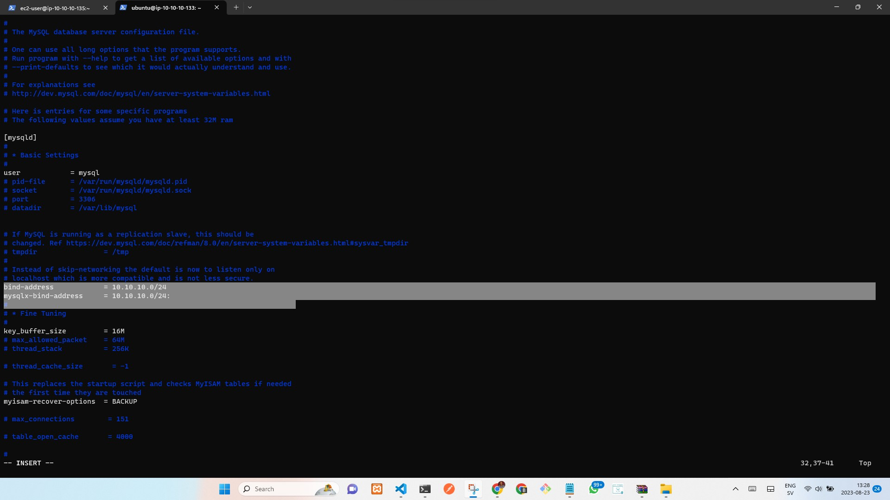

Enable, Start, and view mysql of MYSQL

    sudo systemctl enable mysql
```
sudo systemctl start mysql
 ```
    sudo systemctl status mysql
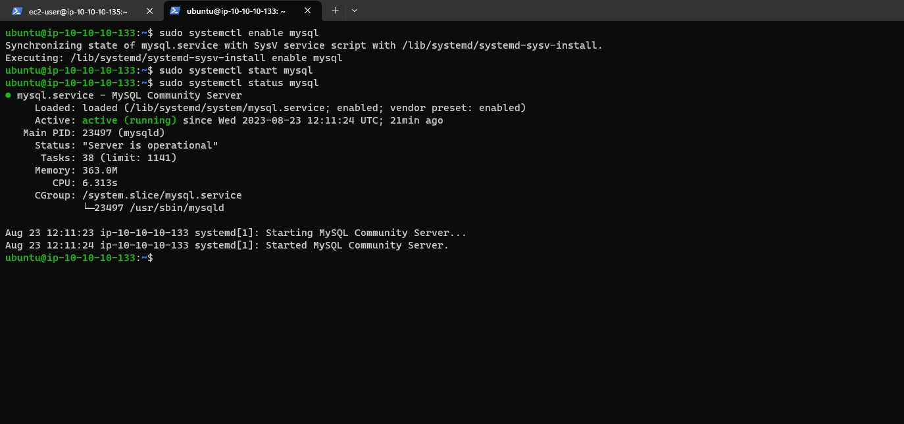
### Step 3 — Prepare the Web Servers

1. Install NFS client on the webserver1: 

    sudo yum install nfs-utils nfs4-acl-tools -y

2. Mount /var/www/ and target the NFS server’s export for apps (Use the private IP of the NFS server)
```
sudo mkdir /var/www
```
    sudo mount -t nfs -o rw,nosuid 10.10.10.135:/mnt/apps /var/www


3. Verify that NFS was mounted successfully by running `df -h` Make sure that the changes will persist on Web Server after reboot:
```
sudo vi /etc/fstab
```
4. Add the following line in the configuration file: 
```
10.10.10.135:/mnt/apps /var/www nfs defaults 0 0
```


5. Install Remi’s repository, Apache and PHP:

    sudo yum -y install httpd php php-mysqlnd php-fpm php-json php-curl php-opcache php-gd 
```
sudo systemctl start php-fpm
```
    sudo systemctl enable php-fpm
```
setsebool -P httpd_execmem 1
```


6. #### Repeat steps 1-5 for the other 2 webservers

7. Locate the log folder for Apache on the Web Server and mount it to NFS server’s export for logs. Repeat step №3 and №4 to make sure the mount point will persist after reboot:
```
sudo mount -t nfs -o rw,nosuid 10.10.10.135:/mnt/logs /var/log/httpd
```
    sudo vi /etc/fstab

 ```
10.0.2.153:/mnt/logs /var/log/httpd nfs defaults 0 0
```
- Fork the tooling source code from **https://github.com/ChinenyenwaN1/tooling.git** Github Account to your Github account. 
Begin by installing git on the webserver: `sudo yum install git -y`
Initialize Git: `git init`

Then run: 

```
git clone https://github.com/Gshare-dev/Web-tooling.git
```


Deploy the tooling website’s code to the Webserver. Ensure that the html folder from the repository is deployed to /var/www/html

On the webserver, ensure port 80 in open to all traffic in the security groups.
Update the website’s configuration to connect to the database: 

    sudo vi /var/www/html/functions.php


Apply tooling-db.sql script to your database using this command 

    $db = mysqli_connect('10.10.10.133', 'webacces', 'password', 'toolling');

Install mysql client

    sudo yum install mysql -y

The tooling-db.sql will deploy every neccessary tables into the tooling database.
```
mysql -h 10.10.10.133 -u webaccess -p tooling < tooling-db.sql
```

Finally, open the website in your browser with the public IP of the webserver and make sure you can login into the website with admin user.


