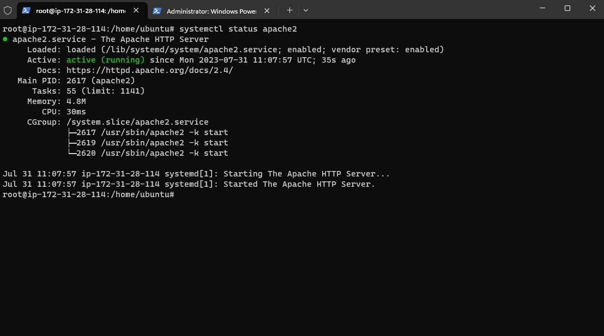
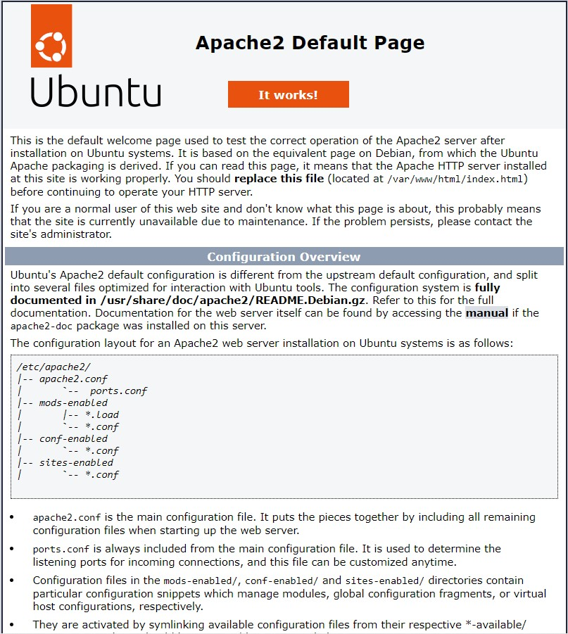
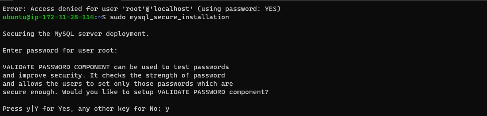
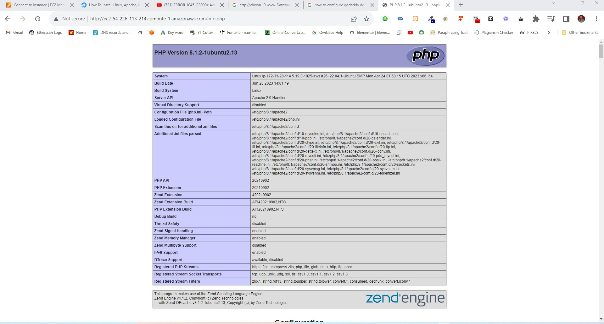

## Detailed  Documentation Of  Linux, Apache, MySQL, and PHP (LAMP) Implementation

The LAMP stack is a popular open-source web development environment that consists of four main components, which together enable the creation and deployment of dynamic websites and applications.

LAMP stands for:

Linux: This is the operating system on which the stack runs. Linux provides a stable and secure foundation for hosting web applications.

Apache: Apache is a web server software that handles HTTP requests and serves web content to users. It's responsible for receiving requests from web browsers and delivering the appropriate web pages or files in response.

MySQL: MySQL is a relational database management system (RDBMS) that stores and manages the data for your web application. It provides a structured and efficient way to organize and retrieve data.

PHP: PHP is a server-side scripting language that is used to build dynamic and interactive web pages. It allows developers to embed code within HTML to create web applications that can process user input and generate customized content.

The LAMP stack's components work together to provide a complete environment for web development. Linux serves as the operating system, Apache handles web server functions, MySQL manages the database, and PHP processes server-side logic and generates dynamic web content. This stack has been widely used to power a variety of websites and applications due to its flexibility, ease of use, and the open-source nature of its components..

 
<h3> Launching A New EC2 Instance in the AWS cloud</h3>

With my aws account already setup, I launched a new EC2 Instance of t2.micro family with Ubuntu Server 22.04 LTS (HVM) and downloaded a new private key (.pem file). Afterward, I connect to my EC2 server via SSH on my Windows Terminal

<h3>Apache Instaalation and Configuration</h3>

After a successful connection, next is configuring the EC2 machine to be able to serve a web server. The following are the steps I took to installing Apache on the EC2 machine on the terminal window:

Updating a list of packages in package manager:
    
    sudo apt update -y

Upgrade all available packages with:

        sudo apt upgrade -y

Run apache2 package installation: 

    sudo apt install apache2

To verify the status of the apache webserver after installation, run this code

    sudo systemctl status apache2

 

Next is the copy and paste the AWS public IPV4 address into a browser tab. You should an output similar to the image below.

## MYSQL Installation and Configuration
Now that the Apache web server is ruunung fine, we have to install MYSQL database which will store and manage the website data.

    sudo apt install mysql-server

 To verify if the inatallation is successful we have to log in to the mysql console with the line below:
 
    mysql

To exit the console, simply type:

    mysql> exit

Now, we need to configure mysql, set password, and other options

     sudo mysql_secure_installation

Follow the following prompts to set the password, and select yes (y) for every other prompts that follow it.

## Installation of PHP and depenencies

After Apache and Mysql have been successfully installed, we php and all it dependencies like Libapache-mod-php, and php-mysql. The command below we intall all these three at once.

    sudo php libapache-mod-php php-mysql

 With the commonad below we will be verify the installation of PHP by checking the version installed.

    sudo php -v

## Creating a Virtual Host for my Website on Apache

Creating a Virtual Host for your Website. Apache has one virtual host enable, which serves as the virtual host for the default frontpage. Now we're create a new one for our website in /var/ww/ directory.

    sudo mkdir /var/www/oluwagbengaajimoti.com.ng

Next, we assign ownership of the directory with #USER:#USER

    sudo chown -R $USER:$USER /var/www/oluwagbengaajimoti.com.ng

Then, we create a new site configuration in the sites-available directory use our preferred editor.

    sudo nano /etc/apache2/sites-available/oluwagbengaajimoti.com.ng.conf
This will open up an empty file, copy and paste the below configuration text into it. NOTE: replace oluwagbengaajimoti.com.ng with your domain.
    
           <VirtualHost *:80>
                ServerName oluwagbengaajimoti.com.ng
                ServerAlias www.oluwagbengaajimoti.com.ng
                 ServerAdmin webmaster@localhost
                 DocumentRoot /var/www/oluwagbengaajimoti.com.ng
                 DirectoryIndex index.php
                 ErrorLog ${APACHE_LOG_DIR}/error.log
                 CustomLog ${APACHE_LOG_DIR}/access.log combined
            </VirtualHost>

Now, use a2ensite to enable the new virtual hos

    sudo a2ensite oluwagbengaajimoti.com.ng

Then, with disa2site we will disable the default 000-default.conf file
   
    sudo a2dissite 000-default

 Now, reload the apache server with:
     
     Sudo systemctl reload apache2
    
Lastly in this section, we create a html file the /var/www/oluwagbengaajimoti.com.ng directory to checkout site configuration.
          
    sudo nano /var/www/oluwagbengaajimoti.com.ng/index.html

Then, paste this

       <html>
          <head>
             <title>your_domain website</title>
          </head>
          <body>
             <h1>Hello World!</h1>
             
This is the landing page of <strong>oluwagbengaajimoti.com.ng</strong>.

          </body>
      </html>

 .jpg)

## PHP Test

To test the PHP , we have to create info.php in the sudo nano /var/www/oluwagbengaajimoti.com.ng directory, and add php code that display php details.

    sudo nano /var/www/oluwagbengaajimoti.com.ng/info.php

insert this into the info.php page:

    <?php
    phpinfo();

Lastly, include /info.php in the server IP address in the browser, and you should see this:

 
      