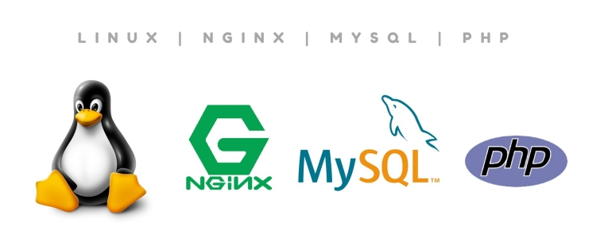
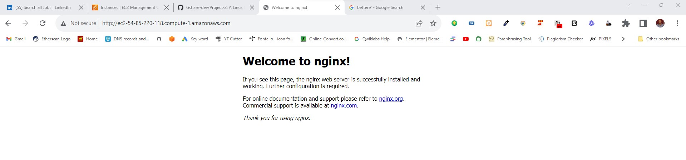
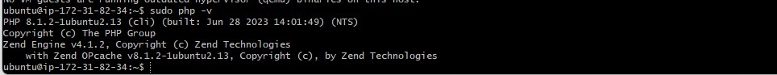
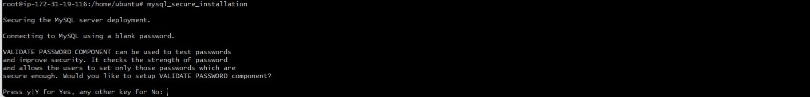
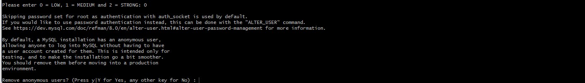
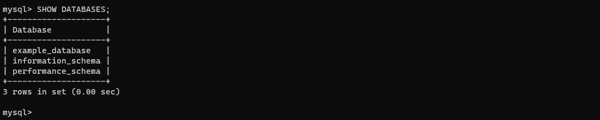
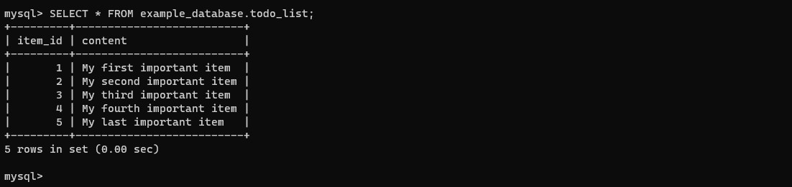
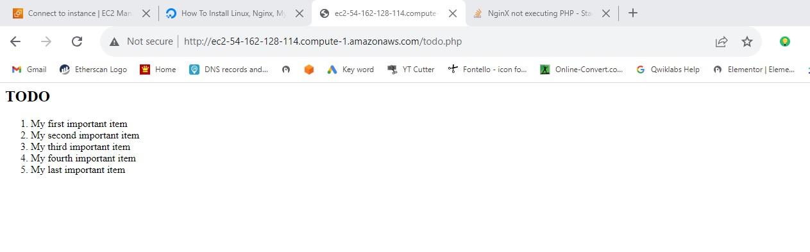

## A Linux OS, Nginx Server, MySQL Database, PHP. (LEMP) Implementation
The LEMP stack is a popular alternative to the LAMP stack for web development and stands for:

Linux: Just like in the LAMP stack, Linux serves as the operating system for hosting the web applications.

Nginx: Nginx (pronounced "engine-x") is a high-performance web server and reverse proxy. It's known for its efficiency in handling concurrent connections and serving static content quickly.

MySQL: Similar to the LAMP stack, MySQL is used as the relational database management system for storing and managing the application's data.

PHP-FPM: Instead of using traditional PHP with Apache (as in LAMP), the LEMP stack uses PHP-FPM (FastCGI Process Manager) to process PHP scripts. PHP-FPM is designed for better performance and resource management in conjunction with Nginx.

## SERVER & NGINX SET UP

The first step into this project is to connect to the ubuntu server through ssh with the line below. Replace 'Myerver-key.pem' with the path of your key pair or you navigate to the key pair directory and connect from there like I am doing here. Also, 'replace ubuntu@ec2-34-201-63-112.compute-1.amazonaws.com' with your server name and url/IP address.

	sudo ssh -i "Myserver-key.pem" ubuntu@ec2-34-201-63-112.compute-1.amazonaws.com

Then we updating and upgrade the server once with the line below:

	sudo apt update && sudo apt upgrade -y

Now, we  have to install Nginx Webserver with the line below:

	sudo apt install nginx -y

Once nginx has been properly installed, the server IP address will display Nginx default when put in a browser. With this we will verify that the nginx has been successfully installed.

## MYSQL Installation and Configuration

Now that the Nginx server is ruunung, we have to install MYSQL database which will store and manage the website data.

    sudo apt install mysql-server -y

 To verify if the inatallation is successful we have to log in to the mysql console with the line below:
 
    sudo mysql

To exit the console, simply type:

    mysql> exit

Now, we need to configure mysql, set password, and other options

     sudo mysql_secure_installation

Follow the following prompts to set the password, and select yes (y) for every other prompts that follow it.

To exit the console, use this line:

	exit

## Installation of PHP and depenencies

After NginX and Mysql have been successfully installed, it time we install php and all it dependencies. The command below we intall it all all the necessary dependencies

	sudo apt php8.1-fpm php-mysql -y

With the commonad below we will be verify the installation of PHP by checking the version installed.

	sudo php -v

Moving forward, we will a block in the /var/www directory which is the same has virtual host in apache website. This block is where the content of the website will sit.
	
	sudo mkdir /var/www/oluwagbengaajimoti.com.ng

Assign ownership of the directory with the $USER environment variable
	
	sudo chown -R $USER:$USER /var/www/oluwagbengaajimoti.com.ng

After this, we'll create a dummy index.html file in the  /var/www/oluwagbengaajimoti.com.ng directoty with the line below:

	sudo nano /var/www/oluwagbengaajimoti.com.ng/index.html

Input the html text in the empty file

	<html>
		<head>
			<title>Welcome to Oluwagbenga Ajimoti Site!</title>
			
			</head>
			<body>
				<h1>Welcome to nginx!</h1>
				
If you see this page, The html.index and oluwagbengaajimoti.com.ng are  working fine

			</body>
	</html>

Then, open a new configuration file in Nginx's sites-available directory
	
	sudo nano /etc/nginx/sites-available/oluwagbengaajimoti

Copy and paste the following configuration in the empty file:

    server {
        listen 80;
        server_name oluwagbengaajimoti.com.ng www.oluwagbengaajimoti.com.ng;
        root /var/www/oluwagbengaajimoti.com.ng;

        index index.html index.htm index.php;

        location / {
        try_files $uri $uri/ =404;
        }

        location ~ \.php$ {
            include snippets/fastcgi-php.conf;
            fastcgi_pass unix:/var/run/php/php7.4-fpm.sock;
        }

        location ~ /\.ht {
            deny all;
        }
    }
To check if the configuration setting working fine:

	sudo nginx -t

Now, we activate the configuration file for the website using the line below:
	
	sudo ln -s /etc/nginx/sites-available/oluwagbengaajimoti /etc/nginx/sites-enabled/

Then, deactivate the default configuration file:

	sudo unlink /etc/nginx/sites-enabled/default

Now, we enter the server IP address in a browser

.jpg)

Next, is to set up mysql server for database by starting with validating password
	
	sudo mysql_secure_installation

For the purpose of this practical training I will go for low password:0

Remove anonymous users? (Press y|Y for Yes, any other key for No): y

Select yes(y) for all other prompt

Now, we get into the mysql console

	sudo mysql

create a database named: example_database

	mysql> CREATE DATABASE example_database;

Now I will create a new user and grant it full privileges on the custom database created.

	mysql> CREATE USER 'example_user'@'%' IDENTIFIED WITH mysql_native_password BY 'password';

	mysql> GRANT ALL ON example_database.* TO 'example_user'@'%';

Now, exit and sign in the new user account

	mysql> exit

To sign the new user, follow the line below:

	 mysql -u example_user -p

After logging in to the MySQL console, confirm access to the example_database database:

	mysql> SHOW DATABASES;
	

Now, create a table (todo_list) in example_database

	CREATE TABLE example_database.todo_list (item_id INT AUTO_INCREMENT, content VARCHAR(255),PRIMARY KEY(item_id) );

Insert few rows into todo_list table:

	mysql> INSERT INTO example_database.todo_list (content) VALUES ("My first important item");
	mysql> INSERT INTO example_database.todo_list (content) VALUES ("My second important item");
	mysql> INSERT INTO example_database.todo_list (content) VALUES ("My third important item");
	mysql> INSERT INTO example_database.todo_list (content) VALUES ("My last important item");

To view the input in the database:

	mysql> SELECT * FROM example_database.todo_list;

After comfirming the output, exit the console:
	
	mysql> exit

Now will want to create todo.php file to pull data from the database in the website directory

	sudo nano /var/www/oluwagbengaajimoti.com.ng/todo.php

Copy and paste the file below into the empty file:

	<?php
		$user = "example_user";
		$password = "password";
		$database = "example_database";
		$table = "todo_list";

		try {
		$db = new PDO("mysql:host=localhost;dbname=$database", $user, $password);
		echo "<h2>TODO</h2><ol>"; 
		foreach($db->query("SELECT content FROM $table") as $row) {
			echo "<li>" . $row['content'] . "</li>";
		}
		echo "</ol>";
		} catch (PDOException $e) {
			print "Error!: " . $e->getMessage() . " ";
			die();
		}
	?>b

	
Save and close. 

 goto http://server_domain_or_IP/todo.php

## Summary

In summary, the LEMP stack substitutes Apache with Nginx and employs PHP-FPM instead of mod_php. This configuration is known for its scalability, speed, and ability to handle a high volume of concurrent connections, making it a popular choice for modern web applications.