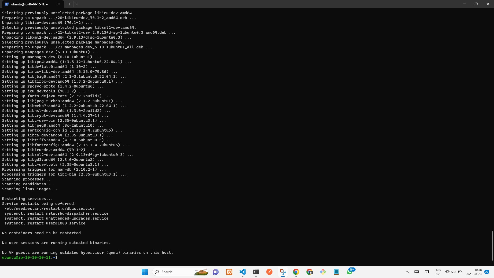
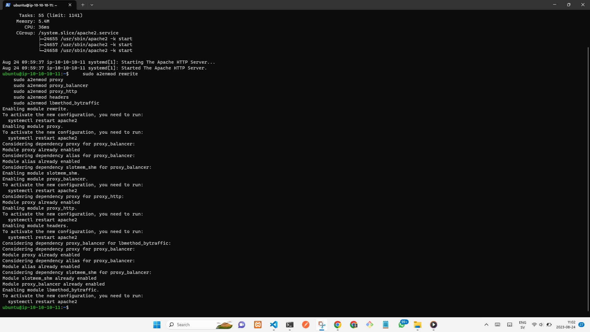
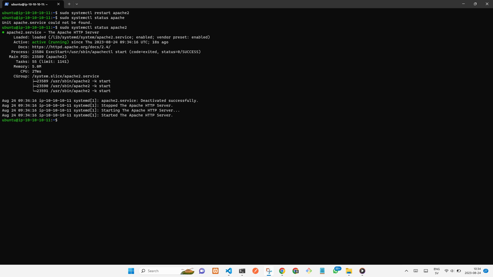
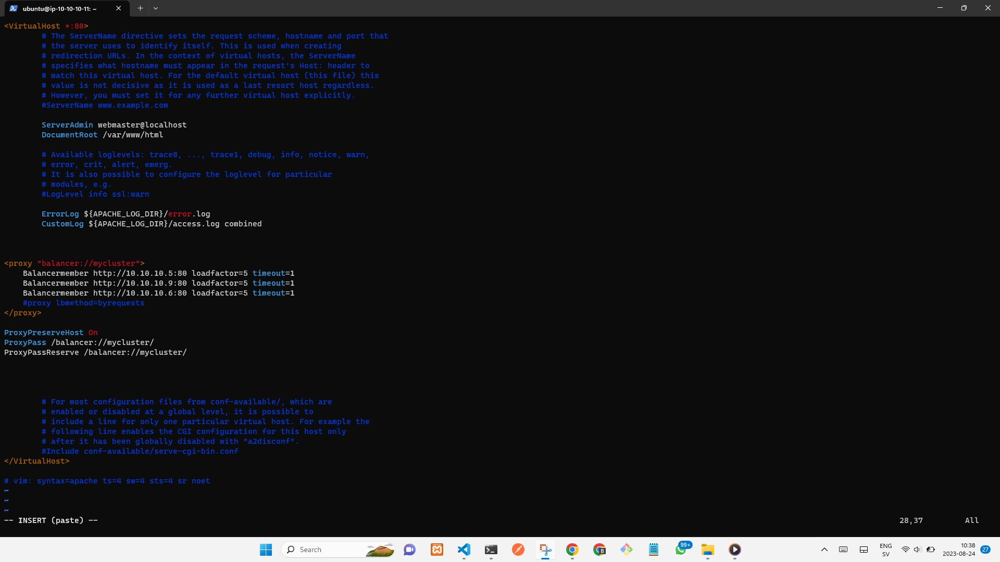
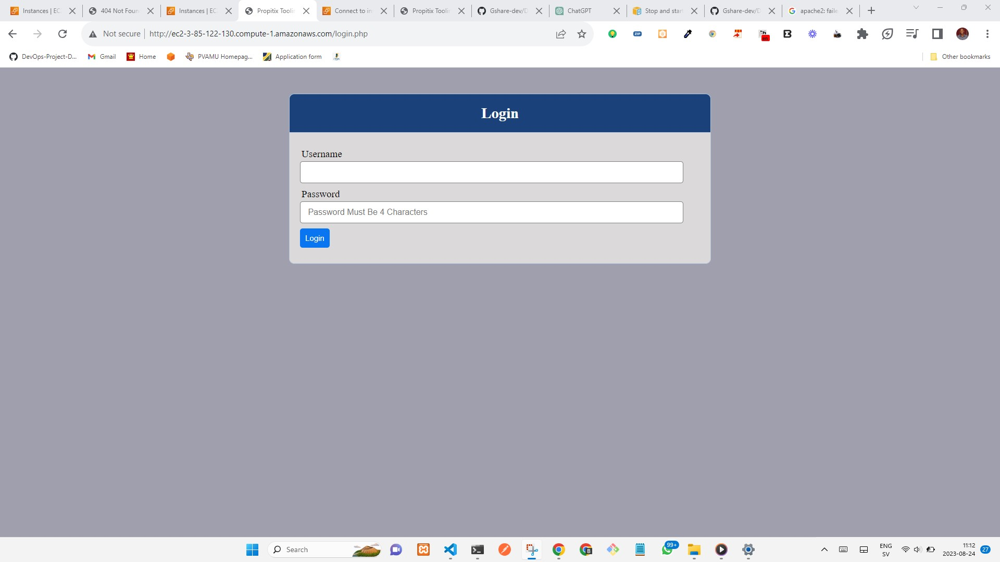
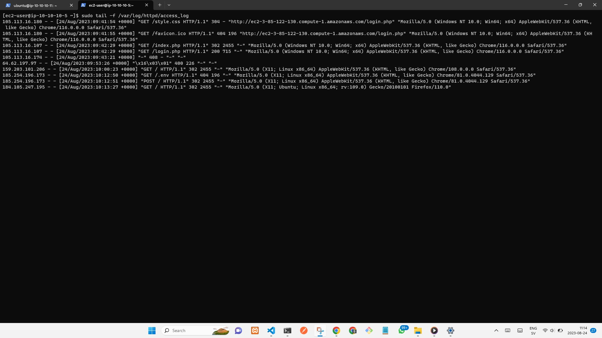
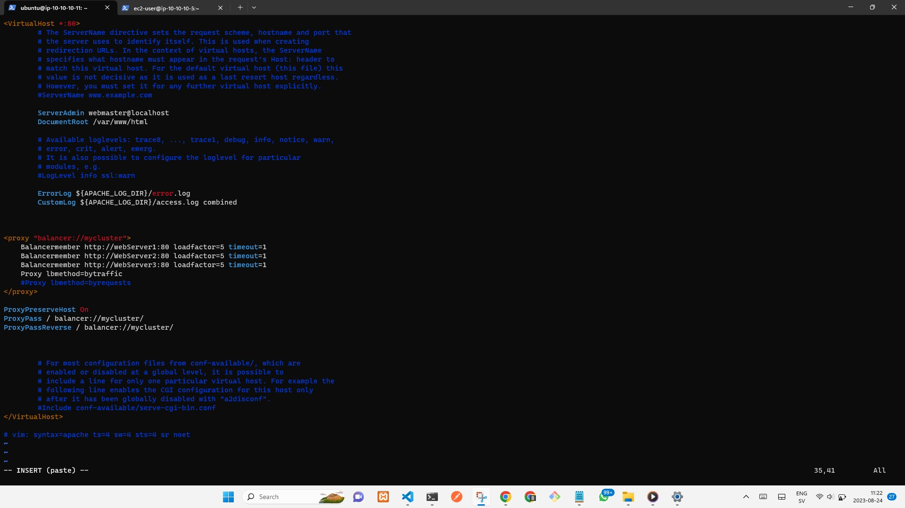

# The Apache Load Balancer

The Apache load balancer, an open-source tool, evenly distributes traffic among server applications. To implement this, I'll configure a "byrequest" Apache load balancer, ensuring fair distribution of requests across three web servers. This helps optimize performance and prevent overloading any single server.


This is a continuation of the [DevOps Tooling Website Solution](https://github.com/Gshare-dev/DEVOPS-TOOLING-WEBSITE-SOLUTION.git) project. In the project, I have already set up a 3-tier application (consisting of an NFS server, a Database server, and three web servers). In this specific phase of the project, I will be configuring a ``byrequest`` Apache load balancer. This configuration will ensure an equitable distribution of traffic across the three web servers.

## Lanuch The Load Balancer Server
Spin up an Ubuntu 22.04 instance on AWS, allow SSH on port ``22``, HTTP on on port ``80`` in the security group of the instance inbound rule.
Log into the instance through SSH, Install Apache, and some modules for apache use.

```` 
sudo apt update && sudo apt upgrade -y
sudo apt install apache2 -y
sudo apt-get install libxml2-dev -y
````
 
Enable the following modules:

    sudo a2enmod rewrite
    sudo a2enmod proxy
    sudo a2enmod proxy_balancer
    sudo a2enmod proxy_http
    sudo a2enmod headers
    sudo a2enmod lbmethod_bytraffic
 
Now, restart Apache and check status

    sudo systemctl restart apache2
    sudo systemctl status apache2


## Configure Load Balancer
In the /etc/apache2/sites-available/ directory, make modifications to the file named 000-default.conf by including the configuration file for the load balancer as provided below:

    sudo vi /etc/apache2/sites-available/000-default.conf
Copy and paste this:
```` 
<Proxy "balancer://mycluster">
    BalancerMember http://10.10.10.138:80 loadfactor=5 timeout=1
    BalancerMember http://10.10.10.136:80 loadfactor=5 timeout=1
    BalancerMember http://10.10.10.132:80 loadfactor=5 timeout=1
    ProxySet lbmethod=bytraffic
    #Proxy lbmethod=byrequests
</Proxy>

ProxyPreserveHost On
ProxyPass / balancer://mycluster/
ProxyPassReverse / balancer://mycluster/
````


        sudo systemctl restart apache2
In an active browser, type ``load-Balancer-IP-Addr/index.php`` 

Since I mount the httpd logs of each of the web server on the NFS logs Logical volume, I will umount it with ``umount`` so to get the log record of each webserver it terminal. On each web server terminal, I will run the command:

    sudo umount -f /var/log/httpd

Now the logs of each web server is now accessible. Run the command below to view log on each web server:

    sudo tail -f /var/log/httpd/access_log



## Configure Local DNS (Optional)
Here, we'll configure a local DNS for the web server IP Addresses on the load balancer by simply navigating into the /etc/ directory, make modification to the file named hosts

    sudo vi /etc/hosts
 Then, copy and paste this:
````
<Web-Server-1-IP-Address> webserver1
<Web-Server-2-IP-Address> webserver2
<Web-Server-2-IP-Address> webserver3
````


After then, return to the ``/etc/apache2/site-available/000-default.conf`` and change the IP addresses to the local DNS name(webserver1, webserver2, webserver3) respectively.



Run the command below to ascertain your configuration:

    curl http://webserver1
    curl http://webserver2
    curl http://webserver3

*Congratulations!* You have successfully configured a load balancer to distribute traffic accross three  webserver to enhance efficiency delivery of website service. 