# Load-Balancer-Solution-With-Nginx-and-SSL-TLS

## Load Balancing

**Load balancing** refers to efficiently distributing incoming network traffic across a group of backend servers.

A load balancer is like a traffic cop for your servers, directing client requests to different servers to make things faster and prevent overloading, and it also handles server failures by sending traffic to the working servers. When a new server is added, the load balancer starts sending requests to it.

In this manner, a load balancer performs the following functions:

- Efficiently spreads out client requests or network load among several servers
- Guarantees availability and dependability by directing requests to online servers only
- Offers the flexibility to adjust the number of servers based on demand


## Configure Nginx As A Load Balancer

- **Create an Instance and name it nginx-lb**

- **Installing Nginx Web Server.**

```
sudo apt update && sudo apt install nginx -y
```
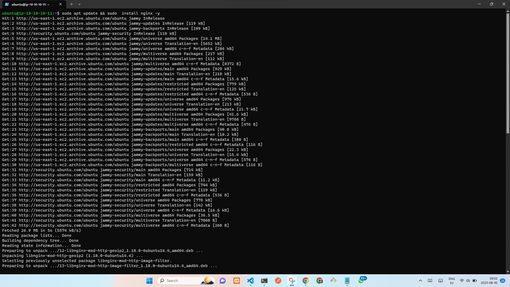

- **Start Nginx at boot time**

```
sudo systemctl enable nginx && sudo systemctl start nginx
```
    sudo systemctl status nginx

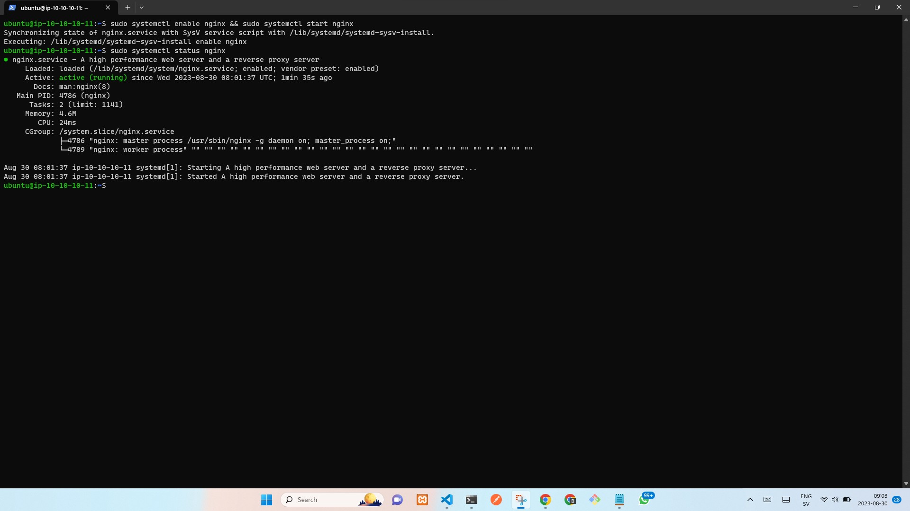

- **Update /etc/hosts file for local DNS with our web servers**


```
sudo nano /etc/hosts
```
- **We will input our web server ip address there.**


```
10.10.10.138 server1
10.10.10.136 server2
10.10.10.132 server3
```

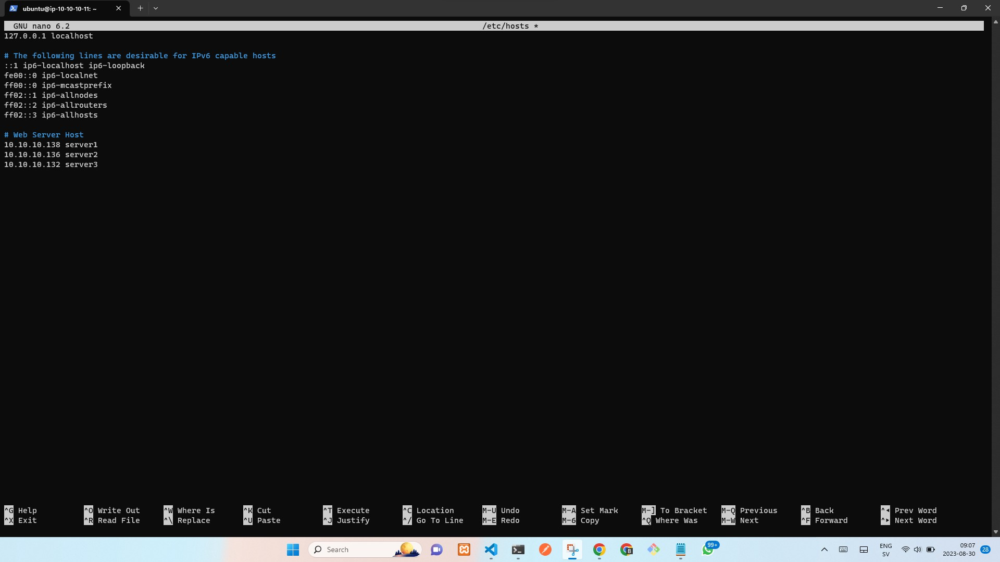

- **Let us now make use of above upstream and server block to create a load balancer for a domain. We need to create a configuration file using a text editor.**


```
sudo nano /etc/nginx/sites-available/load_balancer.conf
```

- **We need to imput the follow into the editor.**


```
upstream web {
    server 10.10.10.138;
    server 10.10.10.136;
    server 10.10.10.132;

}

server {
        listen 80;

        server_name nginx.oluwagbengaajimoti.com.ng www.nginx.oluwagbengaajimoti.com.ng;

        location / {

            proxy_set_header X-Forwarded-For $proxy_add_x_forwarded_for;
            proxy_pass http://web;
        }
}
```


- **We need to test our Nginx config file to know if there is any syntax error.**


```
sudo nginx -t
```
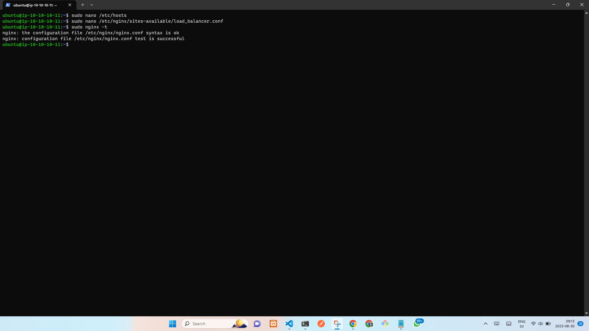

**We need to uremove the default configuration file, and link our config file from site-enabled to site-available.**


     sudo rm -f /etc/nginx/sites-enabled/default

```
cd /etc/nginx/sites-enabled/
```
    sudo ln -s ../sites-available/load_balancer.conf .
```
sudo systemctl reload nginx
```

# Configure Secure Connection To The Load Balancer


## First we need to understand What Is TLS/SSL? and Why Do We Need It?


Secure Sockets Layer (SSL) technology provides security measures implemented at the transport layer. It enables secure communication between web browsers and web servers. In this secure communication, data is encrypted before being sent and decrypted upon receipt. Both the browser and the server encrypt all transmitted data.

SSL addresses the following crucial security concerns:

- Authentication: When establishing communication with a web server over a secure connection, the server presents a set of credentials in the form of a server certificate (also known as a public key certificate) to the web browser. The purpose of this certificate is to verify the authenticity of the site. In some cases, the server might also request a certificate from the client for client authentication.

- Confidentiality: During data transmission between the client and the server on a network, outsiders can intercept and view the data. SSL encryption ensures that the data remains confidential and unreadable by unauthorized parties.

- Integrity: While data is in transit between the client and the server, it can be susceptible to tampering by third parties. SSL safeguards against data modification during transmission by these external entities.


## What is an SSL Certificate And Why Is It Needed?

SSL certificates play a crucial role in securing data transfers, credit card transactions, logins, and personal information. They instill confidence in customers and encourage longer website engagement.

When visitors notice the green padlock indicating an SSL certificate, they tend to spend more time on the website. This is due to the SSL certificate's ability to safeguard information exchanged between a web browser and a web server. This is particularly vital for websites handling sensitive data, such as personal information on membership sites or credit card details on online stores.


## Types of SSL Certificates

A variety of SSL certificate choices exist, each tailored to specific needs and benefits. The extent of authentication provided by the Certificate Authority (CA) distinguishes these types. SSL certificates fall into three main authentication categories:

- Extended Validation (EV)
- Organization Validation (OV)
- Domain Validation (DV)


# Configuring TLS for Tooling website using Letsencrypt

## What is TLS?

TLS is a cryptographic protocol that provides end-to-end security of data sent between applications over the Internet. It is mostly familiar to users through its use in secure web browsing, and in particular the padlock icon that appears in web browsers when a secure session is established. However, it can and indeed should also be used for other applications such as e-mail, file transfers, video/audioconferencing, instant messaging and voice-over-IP, as well as Internet services such as DNS and NTP.


## How does TLS work?

TLS uses a combination of symmetric and asymmetric cryptography, as this provides a good compromise between performance and security when transmitting data securely.

## REGISTER A NEW DOMAIN NAME AND CONFIGURE SECURED CONNECTION USING SSL/TLS CERTIFICATES

Register a domain name with any registrar of your choice in any domain zone (e.g. .com, .net, .org, .edu, .info, .xyz or any other)
Assign an Elastic IP to your Nginx LB server and associate your domain name with this Elastic IP
Create a static IP address, allocate the Elastic IP and associate it with an EC2 server to ensure your IP remain the same everytime you restart the instance.
Update **A record** in your registrar to point to Nginx LB using Elastic IP address

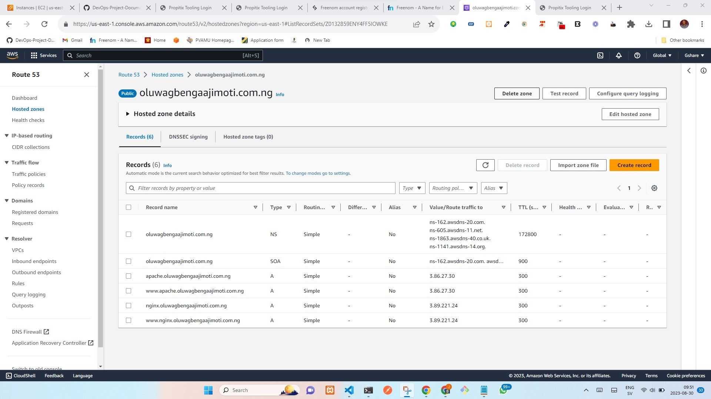

Check that your Web Servers can be reached from your browser using new domain name using HTTP protocol – http://nginx.oluwagbengaajimoti.com.ng

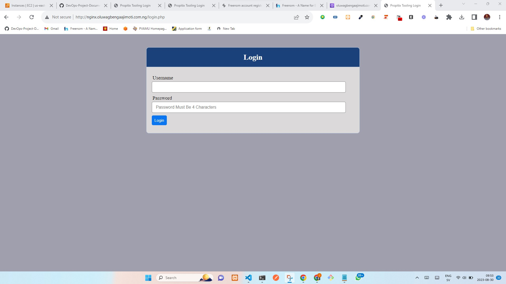


## Letsencrypt

This is a solution geared at making the process of acquiring certificates from a certificate authority (CA) free, automated, and open. It is run by Internet Security Research Group and it gives people the digital certificates they need in order to enable HTTPS (SSL/TLS) for websites, for free, in the most user-friendly way we can


## Step 1: Get the Certbot client

To install Let’s Encrypt certificate, we need to use some client tool to facilitate the process. We will be using the certbot client in this project. However, there are other client tools that can be used. For example, ACMEv2

Certbot is an extensible client that fetches a security certificate from Let’s Encrypt Authority and lets you automate the validation and configuration of the certificate for use by the webserver.


- **Create a folder to do all your letsencrypt work. you can name it anything. Perhaps letsencrypt**


```
sudo apt install certbot -y
```
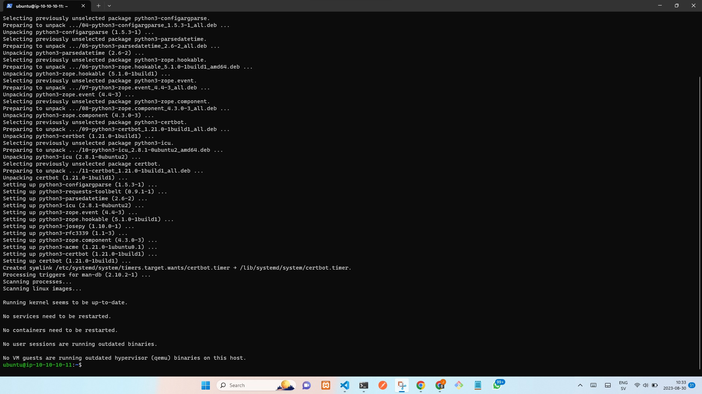

- **We as well need to install certbot dependency.**

```
sudo apt install python3-certbot-nginx-y
```

- **Reload Nginx**

     sudo nginx -s reload

## Ensure Nginx already work based on http before we update Nginx configuration to use https


## Step 2: Install Lets Encrypt Certificate

Use certbot command to initialize the fetching and configuration of Let’s Encrypt security certificate. the flag --nginx tells certbot to automatically update nginx configuration file accordingly. Certbot is a python application, hence it will install multiple Python packages and their dependencies.


```
sudo certbot --nginx -d nginx.oluwagbengaajimoti.com.ng -d www.nginx.oluwagbengaajimoti.com.ng
```

Follow the interactive prompt and answer the questions as requested. You will be asked to provide an email address and accept the terms of service. If everything works out well, you will get a congratulations message at the end. To confirm that your Nginx site is encrypted, reload the webpage and observe the padlock symbol at the beginning of the URL. This indicates that the site is secured using an SSL/TLS encryption.

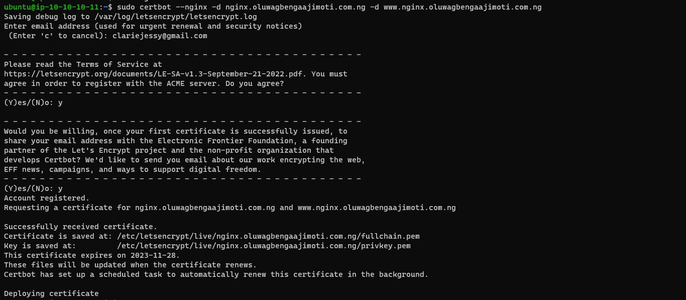
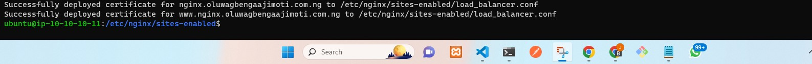

Check that your Web Servers can be reached from your browser using new domain name using HTTP protocol – http://nginx.oluwagbengaajimoti.com.ng

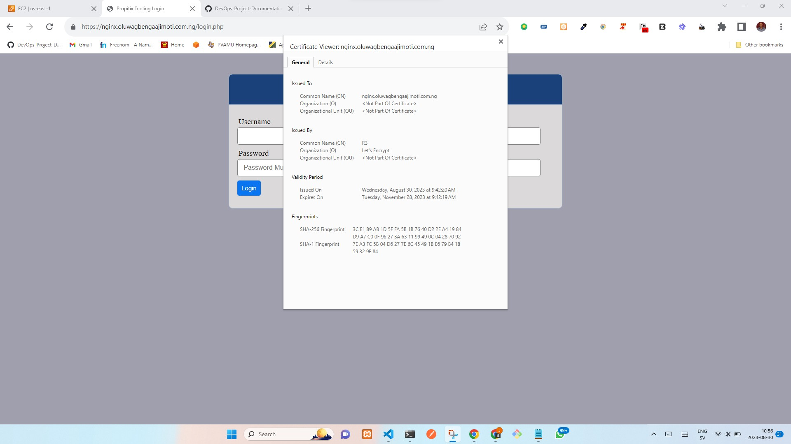


## Step 2: Set up Automatic Renewal

Right now, we have a valid certificate from LEtsencrypt. But we’ll also need to make sure that our certificate stays renewed and valid.

By default, Let’s Encrypt certificates are valid for 90 days. It is recommended to renew the certificate before it expires since an expired certificate will give
users a safety warning when they try to visit your website.

You can test the renewal process manually with a --dry-run flag. So that you can understand what happens internally.

Simply run


```
certbot-auto renew --dry-run
```

The above command will automatically check the currently installed certificates and will attempt to renew them if they are less than 30 days away from the 
expiration date.

Best pracice is to have some scheduler to run a job that runs that command periodically. Assuming we want to always run the command twice everyday. We can use 
cronjob to do the job.


- **To do so, lets edit the crontab file with the following command:**

```
crontab -e
```
- **Add the following line:**

```
* */12 * * *   root /usr/local/bin/certbot-auto renew >/dev/null 2>&1
```
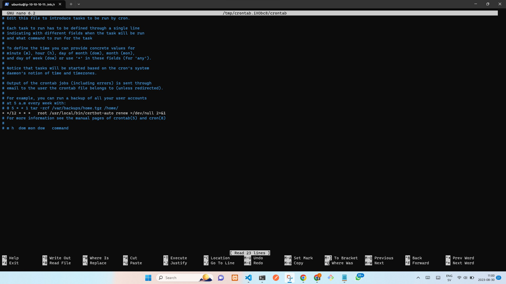

We can always change the interval of this cronjob if twice a day is too often by adjusting the values on the far left.
