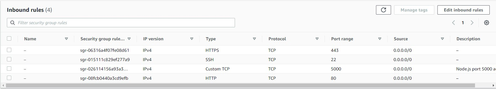
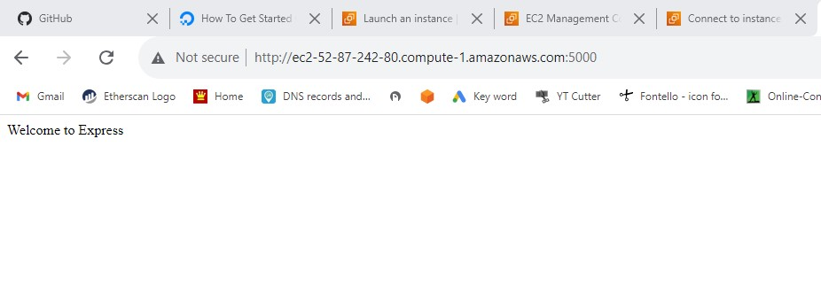
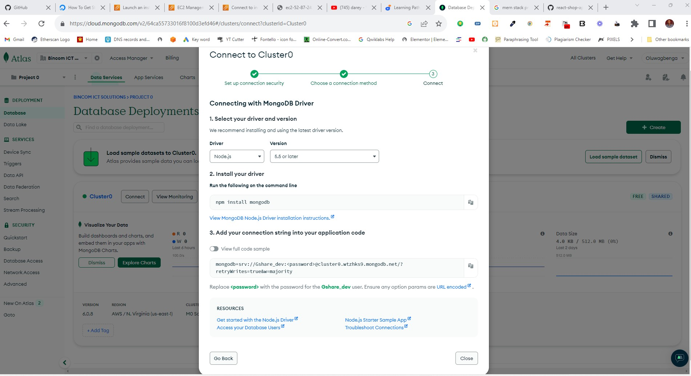
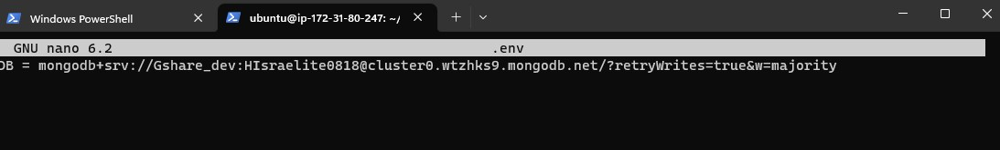
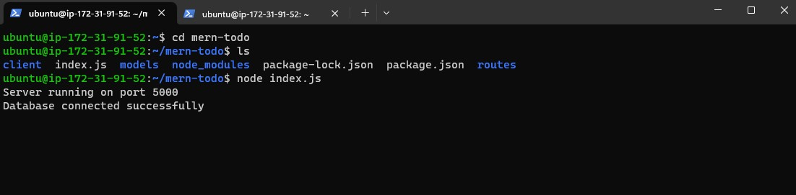

## A Linux MongoDB, Express.js, React.js, and Node.js (MERN) Stack Project Deployment

The MERN stack is a popular combination of technologies used for building modern web applications. It consists of:

MongoDB: Similar to the MEAN stack, MongoDB is a NoSQL database that stores data in a flexible, JSON-like format, making it suitable for handling various types of data and scaling applications.

Express.js: Express.js is a backend web application framework for Node.js. It simplifies the process of building APIs, handling routing, and managing server-side logic.

React: React is a JavaScript library for building user interfaces. It enables the creation of dynamic and interactive frontend components, helping developers build modern, single-page applications (SPAs).

Node.js: Node.js is a runtime environment that allows server-side JavaScript execution. In the MERN stack, it works with Express.js to handle backend operations and provide a consistent language and environment throughout the application.

In this project we will deploy a Todo apllication in a javascript runtime environment. We will use react.js to design the user's interface(frontEnd). Express.js will provide a powerful backend framework for the project and enhance the implementation the user's experience, MongoDB cloud database solution (Atlas) will serves as the application document database, and Node.js will be the project runtime environment(Javascript server). All these will beon Amazon EC2 Ubuntu instance that will serve as our server.

We will kick-off from the terminal by connecting to EC2 instance through SSH. For the purpose of smooth connection, I have navigated to the my 'Downloads' directory where the EC2 instance key-pair is located.

	ssh -i "Myserver-key.pem" ubuntu@ec2-52-87-242-80.compute-1.amazonaws.com

After the connecting, we will Update and upgrade the server at once.

	sudo apt update && sudo apt upgrade -y

Next, we need to install the node on the server by running the command line:

	Sudo apt install nodejs

To verify  the installation of node.js, we will check for the versio installed withe the command line:

	node -v

Now will need to comfirm if the node.js installation comes with the package manager 'vpm' just like apt is the package manger for ubuntu.

	npm -v

If no version detaills displayed, manually intall the node.js package manager with the line below:

	sudo apt install npm

Next, we create a directory 'todo' and nagivate into the new directory:

	sudo mkdir todo
	cd todo

Now that will are the 'todo' directory, we need to initialize the project by running the command below. This will create a new file names package.json.

	npm init -y
## Server Set UP

Now we need to install express.js. Express.js is most powerful node.js framework, it simplifies work for developer, and require just littel code to perform operations. To install, use the line below.

	npm install express

Since our default entry point from the 'npm initialization' is index.js, we need to create the index.js file.

	touch index.js

next the 'ls' to verify index.js file
Next, we need to install dotenv module

	npm install dotenv

Once that is done, we copy a code snippets into the index.js file usinf your preferred editor.

	const express = require('express');
	require('dotenv').config();
	const app = express();

		const port = process.env.PORT || 5000;

		app.use((req, res, next) => {
		res.header('Access-Control-Allow-Origin', '*');
 		 res.header('Access-Control-Allow-Headers', 'Origin, X-Requested-With, Content-Type, Accept');
 		 next();
		});

		app.use((req, res, next) => {
		  res.send('Welcome to Express');
		});

		app.listen(port, () => {
		  console.log(`Server running on port ${port}`);
		});

It time to start the server. In the todo directory where the index.js is located, run the command below:

	node index.js

If everything goes well, you should see 'Server running on port 5000' We have not design our frontpage it will be a bit difficult to view in a browser. since our server is no EC2 instance, we have to setup our security group inbound rules to access on port:5000.  

You should get this in the browser after entering 'serverIPaddress:5000'

## Now, We move into routing

Our todo apllication will perform three functions:

1. Create a new task
2. Display all the tasks
3. Delete completed task(s)

Each of this three functions requires an endpoint, and will use HTTP request methods 'POST, GET, DELETE'
So we will create a folder routes and create a file api.js with the following code in it.

	mkdir routes

Edit api.js and paste the following code in it. it will provide placeholder routes for GET, POST, and DELETE.

    const express = require('express');
    const router = express.Router();

    router.get('/todos', (req, res, next) => {
    // get placeholder
    });

    router.post('/todos', (req, res, next) => {
    // post placeholder
    });

    router.delete('/todos/:id', (req, res, next) => {
    // delete placeholder
    });

    module.exports = router;

Now, we have get to the modelling part. Since the app is going to make use of MongoDB which is a NoSQL database, we need to create a model and a schema. Models are defined using the schema interface. The schema allows you to define the fields stored in each document along with their validation requirements and default values. In essence, the schema is a blueprint of how the database will be constructed. In addition, you can define static and instance helper methods to make it easier to work with your data types, and also virtual properties that you can use like any other field, but which aren’t stored in the database.

To create a schema and a model, install Mongoose which is a Node package that makes working with MongoDB easier.

	# ensure that you are in the `mern-todo` project directory
	npm install mongoose

Create a new folder in todo directory and name it models. Inside it create a file and name it todo.js.

	mkdir models

Paste the following into todo.js with your text editor:

    const mongoose = require('mongoose');
    const Schema = mongoose.Schema;

    // Create schema for todo
    const TodoSchema = new Schema({
    action: {
        type: String,
        required: [true, 'The todo text field is required'],
    },
    });

    // Create model for todo
    const Todo = mongoose.model('todo', TodoSchema);

    module.exports = Todo;

Now, we need to update our routes to make use of the new model. The routes/api.js

    const express = require('express');
    const router = express.Router();
    const Todo = require('../models/todo');

    router.get('/todos', (req, res, next) => {
    // This will return all the data, exposing only the id and action field to the client
    Todo.find({}, 'action')
        .then((data) => res.json(data))
        .catch(next);
    });

    router.post('/todos', (req, res, next) => {
    if (req.body.action) {
        Todo.create(req.body)
        .then((data) => res.json(data))
        .catch(next);
    } else {
        res.json({
        error: 'The input field is empty',
        });
    }
    });

    router.delete('/todos/:id', (req, res, next) => {
    Todo.findOneAndDelete({ _id: req.params.id })
        .then((data) => res.json(data))
        .catch(next);
    });

    module.exports = router;

## Connect to the database

It time to connect to database, but before then will have to updare the index.js file with the code below:

    const express = require('express');
    const bodyParser = require('body-parser');
    const mongoose = require('mongoose');
    const routes = require('./routes/api');
    require('dotenv').config();

    const app = express();

    const port = process.env.PORT || 5000;

    mongoose
    .connect(process.env.DB, { useNewUrlParser: true })
    .then(() => console.log(`Database connected successfully`))
    .catch((err) => console.log(err));

    Since mongoose's Promise is deprecated, we override it with Node's Promise
    mongoose.Promise = global.Promise;

    app.use((req, res, next) => {
    res.header('Access-Control-Allow-Origin', '*');
    res.header('Access-Control-Allow-Headers', 'Origin, X-Requested-With, Content-Type, Accept');
    next();
    });

    app.use(bodyParser.json());

    app.use('/api', routes);

    app.use((err, req, res, next) => {
    console.log(err);
    next();
    });

    app.listen(port, () => {
    console.log(`Server running on port ${port}`);
    });

Since our server is running on AWS cloud solution, it is best to use Atlas which is the best for implementing on cloud database for all cloud infrastructures. For the purpose of this practical work, I will use the <a href="">free tier account </a>

I have set up created my atlas account, set up my database access, network access , and lastly the cluster. Now it is time to connect the database running on atlas with our application.

We need to create .env file in the todo directory to hold our databasebase configuration file. For security reason we would be addinf it to the index.js file.
	
	touch .env

Now, we copy the configuration snippet from Atlas and paste in the .env file and edit it with our atlas account information.

	nano .env
   
After saving and exit, run the the line start the server again

    node index.js

You should get this

 

## REACT SET UP
It time to install all neccessary react dependencies. Run the line below, it will create 'client' directory in the root directory.

    npx create-react-app client

There are many dependencies that need to be installed in the project root directory fot the react to work fine. First, install concurrently as a dev dependency:

    npm install concurrently --save-dev

Then, install nodemon as a dev dependency:

npm install nodemon --save-dev

Next, open your package.json file in the root folder of the app project, and preplace it with '"scripts": {}' code:

    "scripts": {
        "start": "node index.js",
        "start-watch": "nodemon index.js",
        "dev": "concurrently \"npm run start-watch\" \"cd client && npm start\""
    },

Enter into the client folder, then locate the package.json file and add the following key-value pair inside it.

    "proxy": "http://localhost:5000"

    ## Creating reate components

Next, navigate into the client/src directory and add a directory named components, inside the components directory, add the three files Todo.js, Input.js, ListTodo.js. Simply use the command below:

    mkdir components && touch components/Todo.js components/Input.js components/ListTodo.js

Open Input.js file and paste the following:

    import React, { Component } from 'react';
    import axios from 'axios';

    class Input extends Component {
    state = {
        action: '',
    };

    addTodo = () => {
        const task = { action: this.state.action };

        if (task.action && task.action.length > 0) {
        axios
            .post('/api/todos', task)
            .then((res) => {
            if (res.data) {
                this.props.getTodos();
                this.setState({ action: '' });
            }
            })
            .catch((err) => console.log(err));
        } else {
        console.log('input field required');
        }
    };

    handleChange = (e) => {
        this.setState({
        action: e.target.value,
        });
    };

    render() {
        let { action } = this.state;
        return (
        

            <input type="text" onChange={this.handleChange} value={action} />
            <button onClick={this.addTodo}>add todo</button>
        

        );
    }
    }

    export default Input;

After that, open your ListTodo.js file and paste the following code:

        import React from 'react';

    const ListTodo = ({ todos, deleteTodo }) => {
    return (
        <ul>
        {todos && todos.length > 0 ? (
            todos.map((todo) => {
            return (
                <li key={todo._id} onClick={() => deleteTodo(todo._id)}>
                {todo.action}
                </li>
            );
            })
        ) : (
            <li>No todo(s) left</li>
        )}
        </ul>
    );
    };

    export default ListTodo;

Then, in your Todo.js file you write the following code:

    import React, { Component } from 'react';
    import axios from 'axios';
    import Input from './Input';
    import ListTodo from './ListTodo';

    class Todo extends Component {
    state = {
        todos: [],
    };

    componentDidMount() {
        this.getTodos();
    }

    getTodos = () => {
        axios
        .get('/api/todos')
        .then((res) => {
            if (res.data) {
            this.setState({
                todos: res.data,
            });
            }
        })
        .catch((err) => console.log(err));
    };

    deleteTodo = (id) => {
        axios
        .delete(`/api/todos/${id}`)
        .then((res) => {
            if (res.data) {
            this.getTodos();
            }
        })
        .catch((err) => console.log(err));
    };

    render() {
        let { todos } = this.state;

        return (
        

            <h1>My Todo(s)</h1>
            <Input getTodos={this.getTodos} />
            <ListTodo todos={todos} deleteTodo={this.deleteTodo} />
        

        );
    }
    }

    export default Todo;

Now, navigate into client directory and install axios

    npm install axios

You will need to make a little adjustment to your React code. Delete the logo and adjust your App.js to look like this:

        import React from 'react';
    import Todo from './components/Todo';
    import './App.css';

    const App = () => {
    return (
        

        <Todo />
        

    );
    };

    export default App;

Then paste the following code into App.css:

        .App {
    text-align: center;
    font-size: calc(10px + 2vmin);
    width: 60%;
    margin-left: auto;
    margin-right: auto;
    }

    input {
    height: 40px;
    width: 50%;
    border: none;
    border-bottom: 2px #101113 solid;
    background: none;
    font-size: 1.5rem;
    color: #787a80;
    }

    input:focus {
    outline: none;
    }

    button {
    width: 25%;
    height: 45px;
    border: none;
    margin-left: 10px;
    font-size: 25px;
    background: #101113;
    border-radius: 5px;
    color: #787a80;
    cursor: pointer;
    }

    button:focus {
    outline: none;
    }

    ul {
    list-style: none;
    text-align: left;
    padding: 15px;
    background: #171a1f;
    border-radius: 5px;
    }

    li {
    padding: 15px;
    font-size: 1.5rem;
    margin-bottom: 15px;
    background: #282c34;
    border-radius: 5px;
    overflow-wrap: break-word;
    cursor: pointer;
    }

    @media only screen and (min-width: 300px) {
    .App {
        width: 80%;
    }

    input {
        width: 100%
    }

    button {
        width: 100%;
        margin-top: 15px;
        margin-left: 0;
    }
    }

    @media only screen and (min-width: 640px) {
    .App {
        width: 60%;
    }

    input {
        width: 50%;
    }

    button {
        width: 30%;
        margin-left: 10px;
        margin-top: 0;
    }
    }

Also in index.css add the following rules:

        body {
    margin: 0;
    padding: 0;
    font-family: -apple-system, BlinkMacSystemFont, "Segoe UI", "Roboto", "Oxygen", "Ubuntu", "Cantarell", "Fira Sans", "Droid Sans", "Helvetica Neue", sans-serif;
    -webkit-font-smoothing: antialiased;
    -moz-osx-font-smoothing: grayscale;
    box-sizing: border-box;
    background-color: #282c34;
    color: #787a80;
    }

    code {
    font-family: source-code-pro, Menlo, Monaco, Consolas, "Courier New", monospace;
    }
## Summary

In this tutorial, you created a todo app using the MERN stack. You wrote a frontend application using React that communicates with a backend application written using Express.js. You also created a MongoDB backend for storing tasks in a database.